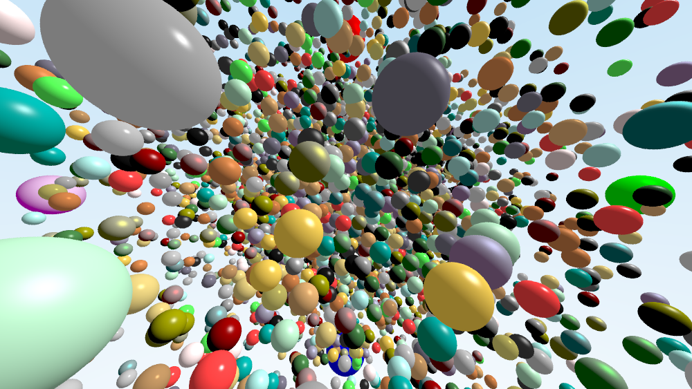
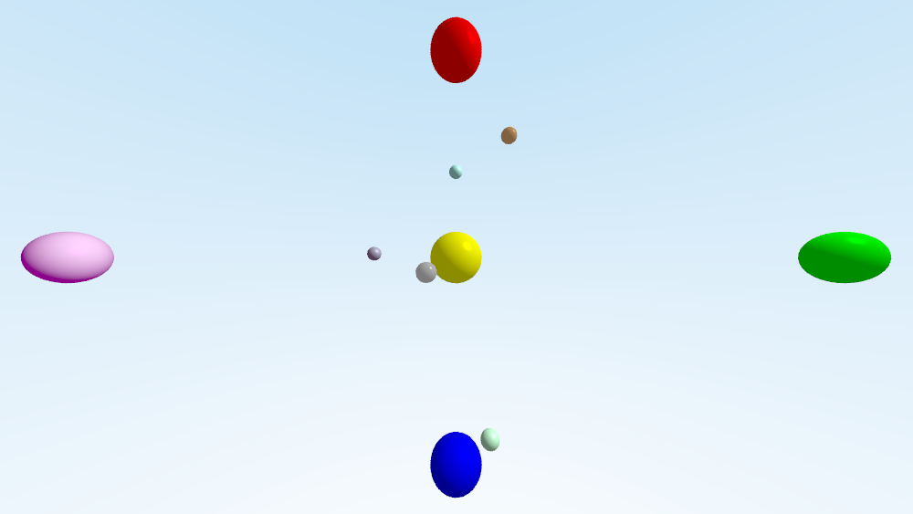
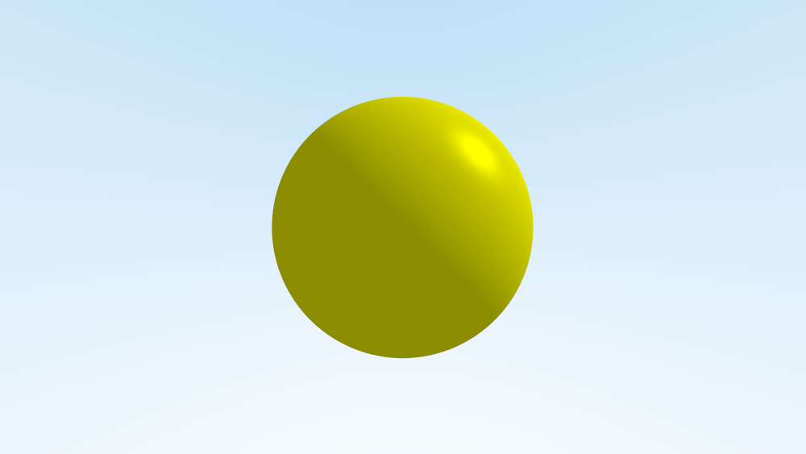
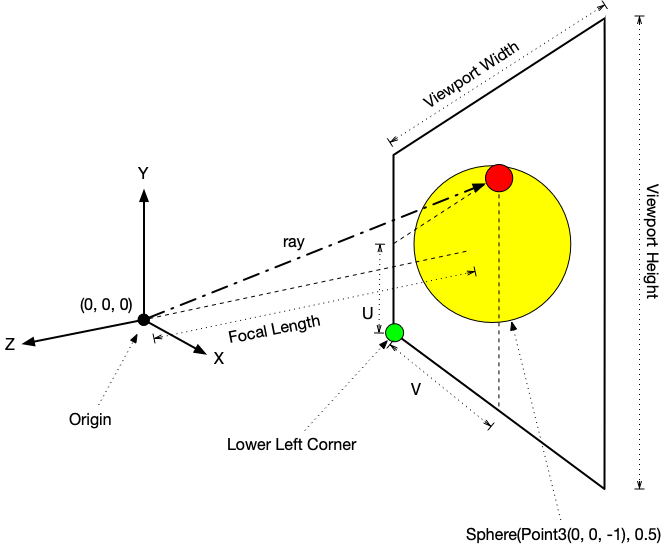

# Rendering Many Spheres

We learned about the  [Phong Reflection model](https://en.wikipedia.org/wiki/Phong_reflection_model) and shaded a single yellow sphere floating in our imaginary sky. This time, we will ray trace many spheres floating in our imaginary sky.



That image has ten thousand spheres! An image like that will take a bit of time to render. On the other hand, if we focus on something simpler, say ten spheres, then our programs output will be easier to work with.



In this example, you can see that there are a total of 10 spheres. There are five spheres that appear larger than the rest: red, green, blue, purple, and yellow. The red sphere appears at the top, the green sphere appears to the right, the blue sphere appears at the bottom, the purple sphere appears to the left, and the yellow sphere is directly in the center. These five spheres will always appear in these locations to help you debug your program.

The other spheres are generated at random. That means their position and color is unpredictable. To help you debug your program, the ray tracer outputs the entire scene everytime it runs describing each sphere in the scene. The scene description for the ten sphere image is given below.

```
--- World Definition Begin ---
Sphere(center=(0, 0, -10), radius=1, material="Plain Yellow")
Sphere(center=(0, 8, -10), radius=1, material="Plain Red")
Sphere(center=(15, 0, -10), radius=1, material="Plain Green")
Sphere(center=(0, -8, -10), radius=1, material="Plain Blue")
Sphere(center=(-15, 0, -10), radius=1, material="Plain Purple")
Sphere(center=(-2.97592, 0.136702, -9.34473), radius=0.25, material="Tin")
Sphere(center=(-0.00688914, 3.18382, -9.55905), radius=0.25, material="Turquoise")
Sphere(center=(-0.708405, -0.355388, -6.09543), radius=0.25, material="Polished Silver")
Sphere(center=(0.895905, -4.78074, -6.74106), radius=0.25, material="Jade")
Sphere(center=(1.6702, 3.83415, -8.07471), radius=0.25, material="Polished Bronze")
--- World Definition End ---
```

Additionally, this ray tracer takes multiple samples of each pixel to smooth the image. This is so we can [anti-alias](https://en.wikipedia.org/wiki/Multisample_anti-aliasing) the image and remove [jaggies](https://en.wikipedia.org/wiki/Jaggies). Compare the two images below.



 
Look closely at the silhouette of each sphere. Notice that the sphere in the upper image has a jagged edge and the sphere in the lower image is smooth. By sending multiple rays out for each pixel in the image, we can calculate smooth changes in colors.

To summarize the additions in this ray tracer, they are:

* Storing many spheres in a [C++ Vector](https://en.cppreference.com/w/cpp/container/vector)

* A class that represents material properties (the color of the sphere)

* Associating a material (a color) for each sphere

* Taking multiple samples to anti-aliase the image (get rid of jaggies)

In order to get this project started, the material property classes were added to this project. The definition of a `Material` and a `PhongMaterial` are in `material.h`. This takes the code that you developed in Lab 11 to shade the sphere and places it into it's own class. This class is then added as a data member to the `Hittable` and `Sphere` classes so that when it comes time to intersect and shade, the material properties are there for you to use.

The plan of attack for this exercise is to complete the following goals:

1. Add anti-aliasing by modifying the main function.
    1. Add a new `const int` to control how many samples to make
    1. Add a loop to the ray generation section to generate as many rays as there are samples; randomize the rays
    1. Sum the color calculated for each ray
    1. Average the color and write it out to the image file
1. Switch the world from a single sphere to a vector of spheres
    1. Replace the world creation in rt.cc to generate a vector
    1. Change the RayColor() function to work with vectors instead of spheres
    1. Change the RayColor() function to intersect the ray with every object in the vector
    1. Calculate the color by calling the `PhongMaterial` method named `reflect_color()`.
1. Switch scene generator to a random scene
    1. Add a new `const int` to control how many spheres to create
    1. Switch the world generation function to create a random world of spheres 

## Add Anti-Aliasing

Below is the main function from Lab 11. Recall that you did not need to make any changes to the main function in Lab 11. The comments have been removed to make it shorter and easier to reproduce and line numbers have been added.

```c++
   1  int main(int argc, char const* argv[]) {
   2    if (argc < 2) {
   3      ErrorMessage("Please provide a path to a file.");
   4      exit(1);
   5    }
   6    string argv_one_output_file_name = string(argv[1]);
   7    const double kAspectRatio = 16.0 / 9.0;
   8    const int kImageWidth = 800;
   9    const int kImageHeight = int(lround(kImageWidth / kAspectRatio));
  10    Image image(argv_one_output_file_name, kImageWidth, kImageHeight);
  11    if (!image.is_open()) {
  12      ostringstream message_buffer("Could not open the file ", ios_base::ate);
  13      message_buffer << argv_one_output_file_name << "!";
  14      ErrorMessage(message_buffer.str());
  15      exit(1);
  16    }
  17    cout << "Image: " << image.height() << "x" << image.width() << "\n";
  18    auto world = Sphere(Point3(0, 0, -1), 0.5);
  19    const double kViewportHeight = 2.0;
  20    const double kViewportWidth = kAspectRatio * kViewportHeight;
  21    const double kFocalLength = 1.0;
  22    const Point3 kOrigin{0, 0, 0};
  23    const Vec3 kHorizontal{kViewportWidth, 0, 0};
  24    const Vec3 kVertical{0, kViewportHeight, 0};
  25    const Vec3 kLowerLeftCorner =
  26        kOrigin - kHorizontal / 2 - kVertical / 2 - Vec3(0, 0, kFocalLength);
  27    chrono::time_point<chrono::high_resolution_clock> start =
  28        chrono::high_resolution_clock::now();
  29    for (int row = image.height() - 1; row >= 0; row--) {
  30      for (int column = 0; column < image.width(); column++) {
  31        double u = double(column) / double(image.width() - 1);
  32        double v = double(row) / double(image.height() - 1);
  33        Ray r{kOrigin,
  34              kLowerLeftCorner + u * kHorizontal + v * kVertical - kOrigin};
  35        Color pixel_color = RayColor(r, world);
  36        image.write(pixel_color);
  37      }
  38    }
  39    chrono::time_point<chrono::high_resolution_clock> end =
  40        chrono::high_resolution_clock::now();
  41    chrono::duration<double> elapsed_seconds = end - start;
  42    cout << "Time elapsed: " << elapsed_seconds.count() << " seconds.\n";
  43    return 0;
  44  }
  45  
```

The first step is to add anti-aliasing because it is easy to add and it will work perfectly with our existing code from Lab 11.

The idea is to generate more than one ray for each pixel. Look at lines 31-36. On lines 31 and 32, the parameters `u` and `v` are being calculated to find the point on our viewplane. Use this visualization to help you understand what `u` and `v` are.



Once `u` and `v` are calculated, they are used to create a new `Ray` on line 33-34. The `Ray` starts at `kOrigin`, in this case (0, 0, 0), and has the direction vector `kLowerLeftCorner + u * kHorizontal + v * kVertical - kOrigin`. This is a ray that starts at the camera and passes through the viewplane at point (`u`, `v`).

In order for us to make many samples, we need to generate many samples. Our first step is to add a constant to control how many samples we will make.

Inbetween lines 9 and 10, add the following code. You can adjust the value to whatever you like. The more samples, the smoother the image. The more samples, the longer the program will take to render.
```c++
  // How many samples to take per pixel; this anti-aliases the image
  // making it appear smoother
  const int kSamplesPerPixel = 10;
```

Before moving on, let's make one other small change. Notice on line 35 that we are declaring and initialzing `Color pixel_color`. Instead, declare `Color pixel_color` between line 28 and 29. Rewrite line 35 so it reads `pixel_color = RayColor(r, world);`.

Next, let's put `kSamplesPerPixel` variable to use by making a loop to generate many rays. We need to put lines 31-35 in a for loop. Change that block to look like the following block of code.

```c++
            for (int s = 0; s < kSamplesPerPixel; s++) {
  31          double u = (double(column) + RandomDouble01()) / double(image.width() - 1);
  32          double v = (double(row) + RandomDouble01()) / double(image.height() - 1);
  33          Ray r{kOrigin,
  34                kLowerLeftCorner + u * kHorizontal + v * kVertical - kOrigin};
  35          pixel_color = pixel_color + RayColor(r, world);
            }

````

The loop generates `kSamplesPerPixel` by repeatedly creating a new ray which starts from the origin but each time goes through a slightly different spot becaues we are adding a little randome number to `u` and `v`. Look at lines 31 and 32 and you can see the functions `RandomDouble01()` being used to add a random number that's between 0 and 1 to the equation.

Finally, notice that on line 35, `pixel_color` is being added to the `RayColor()` and stored back into `pixel_color`. This sums up the colors for the `kSamplesPerPixel` rays that we casted. In order to arrive on the final color, we have to normalize the color stored in `pixel_color`.

Before we get to the point of writing out the color to the image file on line 36, perform the following calculations:
```c++
            // Since the pixel color was sampled kSamplesPerPixel times, we
            // have to take the average
            double scale = 1.0 / double(kSamplesPerPixel);
            double r = Clamp(std::sqrt(pixel_color.r() * scale), 0.0, 1.0);
            double g = Clamp(std::sqrt(pixel_color.g() * scale), 0.0, 1.0);
            double b = Clamp(std::sqrt(pixel_color.b() * scale), 0.0, 1.0);
            pixel_color = Color(r, g, b);
  36        image.write(pixel_color);

```

Compiling and running the program will result in a yellow sphere that will appear smoother around it's edges.


## Switch the World from a Single Sphere to a C++ Vector of Spheres

To achieve this goal, we will need to make changes to the `main()` function as well as the `RayColor()` function.

Below is the main function from Lab 11. The changes discussed in the previous section do not appear in the listingg below. The comments have been removed to make it shorter and easier to reproduce and line numbers have been added.

```c++
   1  int main(int argc, char const* argv[]) {
   2    if (argc < 2) {
   3      ErrorMessage("Please provide a path to a file.");
   4      exit(1);
   5    }
   6    string argv_one_output_file_name = string(argv[1]);
   7    const double kAspectRatio = 16.0 / 9.0;
   8    const int kImageWidth = 800;
   9    const int kImageHeight = int(lround(kImageWidth / kAspectRatio));
  10    Image image(argv_one_output_file_name, kImageWidth, kImageHeight);
  11    if (!image.is_open()) {
  12      ostringstream message_buffer("Could not open the file ", ios_base::ate);
  13      message_buffer << argv_one_output_file_name << "!";
  14      ErrorMessage(message_buffer.str());
  15      exit(1);
  16    }
  17    cout << "Image: " << image.height() << "x" << image.width() << "\n";
  18    auto world = Sphere(Point3(0, 0, -1), 0.5);
  19    const double kViewportHeight = 2.0;
  20    const double kViewportWidth = kAspectRatio * kViewportHeight;
  21    const double kFocalLength = 1.0;
  22    const Point3 kOrigin{0, 0, 0};
  23    const Vec3 kHorizontal{kViewportWidth, 0, 0};
  24    const Vec3 kVertical{0, kViewportHeight, 0};
  25    const Vec3 kLowerLeftCorner =
  26        kOrigin - kHorizontal / 2 - kVertical / 2 - Vec3(0, 0, kFocalLength);
  27    chrono::time_point<chrono::high_resolution_clock> start =
  28        chrono::high_resolution_clock::now();
  29    for (int row = image.height() - 1; row >= 0; row--) {
  30      for (int column = 0; column < image.width(); column++) {
  31        double u = double(column) / double(image.width() - 1);
  32        double v = double(row) / double(image.height() - 1);
  33        Ray r{kOrigin,
  34              kLowerLeftCorner + u * kHorizontal + v * kVertical - kOrigin};
  35        Color pixel_color = RayColor(r, world);
  36        image.write(pixel_color);
  37      }
  38    }
  39    chrono::time_point<chrono::high_resolution_clock> end =
  40        chrono::high_resolution_clock::now();
  41    chrono::duration<double> elapsed_seconds = end - start;
  42    cout << "Time elapsed: " << elapsed_seconds.count() << " seconds.\n";
  43    return 0;
  44  }
  45  
```

Our first step is to change line 18. On line 18, `auto world = Sphere(Point3(0, 0, -1), 0.5);` the world is just a single sphere. To keep things looking the same yet changing our world from a single sphere to a C++ vector, change this line to
```c++
  18    // auto world = Sphere(Point3(0, 0, -1), 0.5);
        auto world = OriginalScene();
```

The function `OriginalScene()` is defined in `utility.h`. It creates the same sphere but puts it into a C++ vector.

The next step is to modify `RayColor()` because that is where we intersect our rays and generate the color for each pixel.

In lab 11, your `RayColor()` function may have looked like a little like the function below. The comments have been removed to make it shorter and easier to reproduce and line numbers have been added.

```c++
   1  Color RayColor(const Ray& r, const Sphere& world) {
   2    HitRecord rec;
   3    Color c;
   4    if (world.hit(r, 0, kInfinity, rec)) {
   5      Color sphere_color{1, 1, 0};
   6      const double kAmbientReflection = 0.3;
   7      const double kDiffuseReflection = 0.7;
   8      const double kSpecularReflection = 0.5;
   9      const double kSpecularShininess = 32.0;
  10      Vec3 light{1, 1, 0.25};
  11      Vec3 to_light_vector = UnitVector(light - rec.p);
  12      Vec3 unit_normal = UnitVector(rec.normal);
  13      Vec3 to_viewer = UnitVector(-rec.p);
  14      Vec3 reflection = Reflect(to_light_vector, unit_normal);
  15      Color phong_ambient = kAmbientReflection * sphere_color;
  16      Color phong_diffuse = kDiffuseReflection *
  17                            Dot(to_light_vector, unit_normal) * sphere_color;
  18      Color phong_specular =
  19          kSpecularReflection *
  20          std::pow(Dot(reflection, to_viewer), kSpecularShininess) * sphere_color;
  21      Color phong = phong_ambient + phong_diffuse + phong_specular;
  22      c = Clamp(phong, 0, 1);
  23    } else {
  24      Color sky_top{0.4980392156862745, 0.7450980392156863, 0.9215686274509803};
  25      Color sky_bottom{1, 1, 1};
  26      Vec3 unit_direction = UnitVector(r.direction());
  27      double t = 0.5 * (unit_direction.y() + 1.0);
  28      c = (1.0 - t) * sky_bottom + t * sky_top;
  29    }
  30    return c;
  31  }
```

Our first step is to change the function's parameter list. We need to change the second parameter from `const Sphere&` to `const std::vector<std::shared_ptr<Hittable>>&`. (Yes, it is very long and complicated but that's just how things work in C++.)

So line 1 should change to:

```c++
      Color RayColor(const Ray& r, const std::vector<std::shared_ptr<Hittable>>& world) {
```

We will have a vector (a list) of many objects to intersect our ray with. We won't know which object in the list that we are intersecting with is the closest unless we keep track of who we hit and how close it is to us. For these reasons, we have to add a few extra variables. Between line 3 and 4, we'll need to add the following:

```c++
   2    HitRecord rec;
   3    Color c;
        HitRecord tmp_rec;
        bool hit_anything = false;
        double t_min = 0.0;
        double closest_so_far = kInfinity;
```

If we hit something, we will set `hit_anything` to true. And if we hit multiple objects, we will record the closest one in `closest_so_far` and `tmp_rec`.

To make this work, we ned to add a loop. Our new `RayColor()` function looks like this:

```c++
      Color RayColor(const Ray& r, const std::vector<std::shared_ptr<Hittable>>& world) {
   2    HitRecord rec;
   3    Color c;
        HitRecord tmp_rec;
        bool hit_anything = false;
        double t_min = 0.0;
        double closest_so_far = kInfinity;
        for (const auto& object : world) {
          if (object->hit(r, t_min, closest_so_far, tmp_rec)) {
            hit_anything = true;
            closest_so_far = tmp_rec.t;
            rec = tmp_rec;
          }
        }
   4    if (world.hit(r, 0, kInfinity, rec)) {
   5      Color sphere_color{1, 1, 0};

```

The problem is line 4 in the listing above. That `if-statement` doesn't make sense anymore. Instead, we need to change it to see if `hit_anything` is true and if it is true to calculate the color. Otherwise, the ray has missed and we can calculate the sky color.

```c++
      Color RayColor(const Ray& r, const std::vector<std::shared_ptr<Hittable>>& world) {
   2    HitRecord rec;
   3    Color c;
        HitRecord tmp_rec;
        bool hit_anything = false;
        double t_min = 0.0;
        double closest_so_far = kInfinity;
        for (const auto& object : world) {
          if (object->hit(r, t_min, closest_so_far, tmp_rec)) {
            hit_anything = true;
            closest_so_far = tmp_rec.t;
            rec = tmp_rec;
          }
        }
       if (hit_anything) {
         c = rec.material->reflect_color(r, rec);
  23    } else {
  24      Color sky_top{0.4980392156862745, 0.7450980392156863, 0.9215686274509803};
  25      Color sky_bottom{1, 1, 1};
  26      Vec3 unit_direction = UnitVector(r.direction());
  27      double t = 0.5 * (unit_direction.y() + 1.0);
  28      c = (1.0 - t) * sky_bottom + t * sky_top;
  29    }
  30    return c;
  31  }
```

The program still generates the same yellow sphere however you are successful in getting it work with C++ vectors and the new `Material` class.

## Random Scene

The final step is to use the utility function `RandomScene()` to generate our computer graphics world. The function `RandomScene()` is defined in `utility.h`.

Go back to your `main()` function and look for the line where you swapped out the yellow sphere for the function `OriginalScene()`. We'll need to create a new `const int` to store how many spheres we'd like to generate and replace the call to `OriginalScene()` with `RandomScene()`.

```c++
  //auto world = OriginalScene();
  const int kNumSpheres = 5;
  auto world = RandomScene(kNumSpheres);
```

Making this small change will replace our one sphere C++ vector with a C++ vector with 10 spheres; 5 random spheres and 5 permanent spheres as described earlier.

## Files

* `hittable.h`

This is an abstract base class which defines how we can make an object hittable by a ray.

* `image.h` & `image.cc`

Defines the class used to create and write a PPM image file. You'll need to know how to open a file, write to a file, and close a file.

* `material.h` & `material.cc`

The material abstract base class and the PhongMaterial class which defines a material which reflects light according to the Phong Reflection model.

* `ray.h` & `ray.cc`

Defines a ray class which is how we calculate what is visible along a line in space. You can think of a ray as a parametric equation for a line:


The ray is made up an origin _O_ and a direction _d_. You can reach any point along the line that a ray defines by plugging in the value of _t_ that corresponds to that point. 

* `rng.h` & `rng.cc`

This is the random number generator that we have used in previous exercises. There are some convenience functions defined in this module.

* `rt.cc`

This is our ray tracing application. The job this file plays is creating all the objects we need and putting them to work. First it opens an image file and gets it ready. Then it creates the neccessary variables to represent the camera (where you are standing and where you are looking) and the viewport (the size and shape of what you see throught the camera).

Once everything is set up and ready to go, we loop through every pixel of our image. At each pixel, we calculate _u_ and _v_.

Calculating _u_ and _v_ can seem somewhat mysterious. The variable _u_ represents how far along we are on a given scanline (row) and the variable _v_ represents how far down from the top of the image have we progressed. We can imagine that each of these variables represent a percentage or ratio.

When _u_ is at 0% or 0.0 it is at the beginning of a scanline. When _u_ is at 50% or 0.5, it is in the middle of a scanline. And when _u_ is at the end of a scanline it is at 100% or 1.0. The way we calculate this value is to count how many pixels we have in a scanline (row) and divide that by the image's width - 1. (We minus 1 because we start counting from 0.)

The value for _v_ is calculated similarly. Instead we count from the top how many scanlines have been completed. In our loop, we are starting _v_ from the bottom of the image and counting down meaning we are at 100% (1.0) when we start and we cound down to 0% (0.0).

Using _u_ and _v_ we generate rays which we then use to calculate the sky's color.

The rays will also be used to intersect with whatever is in our world. In this exercise, there is only one sphere. Each ray will be tested to see if it intersects with the sphere. If it does, then we'll calculate the color of the sphere. Otherwise, the ray is used to calculate the color of the sky.

* `sphere.h` & `sphere.cc`

Defines a sphere class where a sphere is defined by a center point and a radius. The class also defines how to compute ray-sphere intersection.

* `utility.h` & `utility.cc`

Contains a few utility functions that are useful in other parts of the project.

* `vec3.h` & `vec3.cc`

The Vec3 files define Vec3, Point3, and Color. Each of these objects represent an important idea needed for ray tracing. We need Vec3 to help us calculate the spacial relationships between different things in space. We need Point3 to represent points in space such as where we are or where we are looking. Color is critical because we use this object to represent the colors we see in our image.

## Requirements

Complete the program such that it creates an output image file of an imaginary sky. Select appropriate values for `sky_bottom` and `sky_top`.

Complete any `TODO` comments found in the project.

Close any file streams that you open and report any errors encountered.

To compile your program, you use the `make` command. A Makefile is provided for this exercise.

The Makefile has the following targets:
  
* all: builds the project
* clean: removes object and dependency files
* spotless: removes everything the clean target removes and all binaries
* doc: generate HTML documentation from the source code using Doxygen
* format: outputs a [`diff`](https://en.wikipedia.org/wiki/Diff) showing where your formatting differes from the [Google C++ style guide](https://google.github.io/styleguide/cppguide.html)
* tidy: output of the [linter](https://en.wikipedia.org/wiki/Lint_(software)) to give you tips on how to improve your code
* headercheck: check to make sure your files have the appropriate header

## Inline Documentation
The project is thoroughly documented inline using the [Doxygen](https://en.wikipedia.org/wiki/Doxygen) format. The documentation establishes a framework for you to follow so that you can implement all the details of the program. To generate HTML formatted documents to view on your computer use the make target `doc`. For example:

```
$ ls
Doxyfile	Makefile	README.md	find_min.cc
$ make doc
set -e; clang++ -MM -g -Wall -pipe -std=c++14  find_min.cc \
	| sed 's/\(find_min\)\.o[ :]*/\1.o find_min.d : /g' > find_min.d; \
	[ -s find_min.d ] || rm -f find_min.d
doxygen Doxyfile
$ ls
Doxyfile	README.md	find_min.cc
Makefile	doc/		find_min.d
```

The inline documentation is saved in `doc/html`. To view the documentation, use the command `gio open doc/html/index.html` which will open the index file in your web browser.

If the `doxygen` command is not available, for instance when you use `make doc` the output looks like:

```
$ make doc
set -e; clang++ -MM -g -Wall -pipe -std=c++14  find_min.cc \
	| sed 's/\(find_min\)\.o[ :]*/\1.o find_min.d : /g' > find_min.d; \
	[ -s find_min.d ] || rm -f find_min.d
doxygen Doxyfile
make: doxygen: No such file or directory
make: *** [doc] Error 1
```

Then you can install `doxygen` using the command `sudo apt install doxygen doxygen-latex graphviz`.

## Don't Forget

Please remember that:

- You need to put a header in every file.
- You need to follow the [Google C++ Style Guide](https://google.github.io/styleguide/cppguide.html).
- Remove the `TODO` comments.

## Testing Your Code

Computers only ever do exactly what they are told, exactly the way they are told it, and never anything else. Testing is an important process to writing a program. You need to test for the program to behave correctly and test that the program behaves incorrectly in a predictable way.

As programmers we have to remember that there are a lot of ways that we can write the wrong program and only one to a few ways to write the correct program. We have to be aware of [cognitive biases](https://en.wikipedia.org/wiki/List_of_cognitive_biases) that we may exercise that lead us to believe we have correctly completed our program. That belief may be incorrect and our software may have errors. [Errors in software](https://www.wired.com/2005/11/historys-worst-software-bugs/) may lead to loss of [life](https://www.nytimes.com/2019/03/14/business/boeing-737-software-update.html), [property](https://en.wikipedia.org/wiki/Mariner_1), [reputation](https://en.wikipedia.org/wiki/Pentium_FDIV_bug), or [all of the above](https://en.wikipedia.org/wiki/2009%E2%80%9311_Toyota_vehicle_recalls).

### Test strategy

Start simple, and work your way up. Good tests are specific, cover a broad range of fundamentally different possibilities, can identify issues quickly, easily, and directly, without need for much set up, and can almost be diagnosed by inspection if the code fails to execute the test correctly.

## Example Output

Please ensure your program's output is identical to the example below.

```
$ make
set -e; clang++ -MM -g -O3 -Wall -pipe -std=c++14  -D AMD64 vec3.cc \
| sed 's/\(vec3\)\.o[ :]*/\1.o vec3.d : /g' > vec3.d; \
[ -s vec3.d ] || rm -f vec3.d
set -e; clang++ -MM -g -O3 -Wall -pipe -std=c++14  -D AMD64 utility.cc \
| sed 's/\(utility\)\.o[ :]*/\1.o utility.d : /g' > utility.d; \
[ -s utility.d ] || rm -f utility.d
set -e; clang++ -MM -g -O3 -Wall -pipe -std=c++14  -D AMD64 sphere.cc \
| sed 's/\(sphere\)\.o[ :]*/\1.o sphere.d : /g' > sphere.d; \
[ -s sphere.d ] || rm -f sphere.d
set -e; clang++ -MM -g -O3 -Wall -pipe -std=c++14  -D AMD64 rt.cc \
| sed 's/\(rt\)\.o[ :]*/\1.o rt.d : /g' > rt.d; \
[ -s rt.d ] || rm -f rt.d
set -e; clang++ -MM -g -O3 -Wall -pipe -std=c++14  -D AMD64 rng.cc \
| sed 's/\(rng\)\.o[ :]*/\1.o rng.d : /g' > rng.d; \
[ -s rng.d ] || rm -f rng.d
set -e; clang++ -MM -g -O3 -Wall -pipe -std=c++14  -D AMD64 ray.cc \
| sed 's/\(ray\)\.o[ :]*/\1.o ray.d : /g' > ray.d; \
[ -s ray.d ] || rm -f ray.d
set -e; clang++ -MM -g -O3 -Wall -pipe -std=c++14  -D AMD64 material.cc \
| sed 's/\(material\)\.o[ :]*/\1.o material.d : /g' > material.d; \
[ -s material.d ] || rm -f material.d
set -e; clang++ -MM -g -O3 -Wall -pipe -std=c++14  -D AMD64 image.cc \
| sed 's/\(image\)\.o[ :]*/\1.o image.d : /g' > image.d; \
[ -s image.d ] || rm -f image.d
clang++ -g -O3 -Wall -pipe -std=c++14  -D AMD64 -c image.cc
clang++ -g -O3 -Wall -pipe -std=c++14  -D AMD64 -c material.cc
clang++ -g -O3 -Wall -pipe -std=c++14  -D AMD64 -c ray.cc
clang++ -g -O3 -Wall -pipe -std=c++14  -D AMD64 -c rng.cc
clang++ -g -O3 -Wall -pipe -std=c++14  -D AMD64 -c rt.cc
clang++ -g -O3 -Wall -pipe -std=c++14  -D AMD64 -c sphere.cc
clang++ -g -O3 -Wall -pipe -std=c++14  -D AMD64 -c utility.cc
clang++ -g -O3 -Wall -pipe -std=c++14  -D AMD64 -c vec3.cc
clang++ -g -O3 -Wall -pipe -std=c++14  -o rt image.o material.o ray.o rng.o rt.o sphere.o utility.o vec3.o 
$ ./rt
Please provide a path to a file.
There was an error. Exiting.
$ ./rt output_image.ppm
Image: 225x400
--- World Definition Begin ---
Sphere(center=(0, 0, -10), radius=1, material="Plain Yellow")
Sphere(center=(0, 8, -10), radius=1, material="Plain Red")
Sphere(center=(15, 0, -10), radius=1, material="Plain Green")
Sphere(center=(0, -8, -10), radius=1, material="Plain Blue")
Sphere(center=(-15, 0, -10), radius=1, material="Plain Purple")
Sphere(center=(0.280841, 0.575022, -8.34286), radius=0.25, material="Emerald")
Sphere(center=(-1.2582, 1.13191, -7.37025), radius=0.25, material="Jade")
Sphere(center=(1.98502, -1.20207, -5.04744), radius=0.25, material="Gold")
Sphere(center=(-0.0985947, -0.433308, -7.00575), radius=0.25, material="Perl")
Sphere(center=(4.37255, -0.55129, -6.74566), radius=0.25, material="Cyan Plastic")
--- World Definition End ---
Time elapsed: 0.466234 seconds.
$ gm convert output_image.ppm output_image.png
$ gio open output_image.png
```

## Converting PPM Image Files

[Graphics Magick](http://www.graphicsmagick.org) is the recommended utility to convert images from one format to another. The command for Graphics Magick is `gm`. If your Linux installation is missing Graphics Magick package, you can easily install it using the commnd `sudo apt install graphicsmagick`.

To convert from a PPM to a PNG:

```
$ gm convert original_image.ppm converted_image.png
```

To convert from a PPM to a JPG or JPEG:

```
$ gm convert original_image.ppm converted_image.jpg
```

To open the image file from the command line:

```
$ gio open image.png
```
